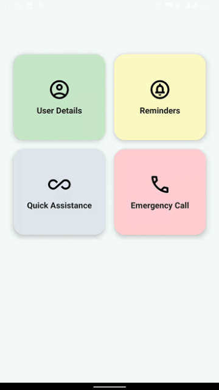

# AI-Based-Healthcare-Application-Kenoha


<p align="center">
  
</p>

<h1 align="center"> <b>AI-Based Healthcare Application – Kenoha</b></h1>

<h3 align="center">Kenoha – Where Smart Meets Heart</h3>

<p align="center">
  
  
  
  
  
</p>

---

## 🌟 Overview

**Kenoha** is an intelligent healthcare assistant designed to make healthcare faster, smarter, and more human-centered.  
It combines **AI assistance**, **voice interaction**, **emergency support**, and **mobile accessibility** into one powerful Android application.

Whether users need quick health guidance, emergency actions, or everyday support, Kenoha is built to help instantly.

---

## 🚀 Core Features

- Voice Assistant  
- Emergency Call Assistance  
- Quick Medical Assistance and Health Tips & Suggestions  
- AI Chat Support  
- Android Mobile Application  
- Live Location Sharing  
- Smart User Experience  
- Scalable Healthcare Ecosystem

---

## 📱 Screenshots


        


---

## 🎥 Demo Working 

        

---

## 🛠️ Tech Stack

### 📱 Frontend

* Kotlin
* XML
* Android Studio

### ⚙️ Backend

* Python
* Flask

### 🗄️ Database

* SQLite

### 🤖 AI / Smart Modules

* Conversational Logic
* Recommendation Engine
* Voice Interaction

---

## 📥 Download & Install

Click below to download the application:

👉 **[Download APK](https://raw.githubusercontent.com/Suhas-2718/AI-Based-Healthcare-Application-Kenoha/main/Android ApplicationApp/Kenoha.apk)**

### Installation steps:
1. Download the APK from the link above.  
2. Transfer it to your Android device (or open directly if downloaded there).  
3. Enable **Install from Unknown Sources** in device settings.  
4. Tap the APK to install.
5. Before opening the app give the **micrphone permission externally** 🎤
6. Open the app and your Assistant is at your assistance

---

## 🧠 How Kenoha Helps Users

- Quick healthcare guidance
- Emergency support in urgent situations
- Reduces confusion during medical need
- Easy mobile accessibility
- Human-friendly healthcare interaction
- AI-powered convenience

---

## ⚙️ Installation

```bash
git clone https://github.com/Suhas-2718/AI-Based-Healthcare-Application-Kenoha.git
```

1. Open project in Android Studio
2. Sync Gradle files
3. Run Flask backend
4. Launch Android app
5. Experience Kenoha 🚀

---

## 📂 Project Structure

```bash
AI-Based-Healthcare-Application-Kenoha/
│── Kenoha_Android_App/
│── Backend/
│── Screenshots/
│── README.md
```

---

## 🔮 Future Enhancements

🚑 Real-time Ambulance Booking
🩺 AI Symptom Prediction
🌍 Multi-language Support
⌚ Smartwatch Integration
📞 Doctor Video Consultation

---

## 👨‍💻 Developer

**Suhas Manjunatha** <br>
**Skanda Shanbhog** <br>
**Vinith Manjunath** <br>
**Prajna Nayak** <br>

---

## 🌐 Repository

GitHub Repo:
https://github.com/Suhas-2718/AI-Based-Healthcare-Application-Kenoha

---

## ⭐ Support

If you like this project:

🌟 Star the repository
🍴 Fork it
📢 Share it

---

<p align="center">
 Clone it and have A Great Experience 😊 
</p>
```

